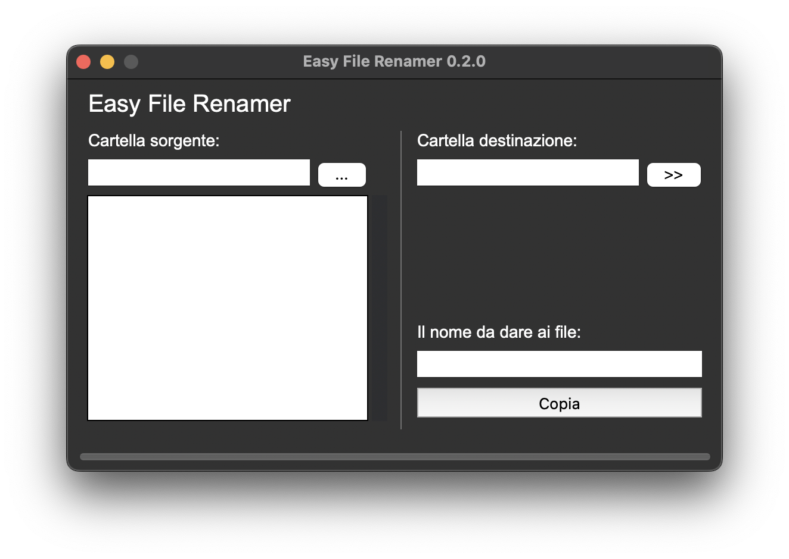

# EasyFileRenamer

## Cos'è

**EasyFileRenamer** è sostanzialmente uno script python molto semplice che prende tutti i file (esclusi quelli nascosti) presenti in una cartella e li copia in un'altra cartella, rinominandoli con un nome scelto dall'utente.

Ho creato questo script principalmente per iniziare ad utilizzare Python in qualcosa di diverso rispetto ai soliti esercizi. Mi è venuta questa idea per rispondere alla domanda che mi ha fatto un mio amico: "Esiste un tool che ti permette di rinominare delle foto in blocco e spostarle in una cartella?".

La mia risposta avrebbe dovuto essere *"sì"*, ma che divertimento ci sarebbe stato?


## Funzionamento

La funzione principale di questo script è la seguente:
```python
def sposta_files_func(file_name, dir_path, destination_path) -> None:
    lista_files = os.scandir(dir_path)
    for i,individual_file in enumerate(lista_files):
        copy(individual_file.path,f"{destination_path}/{file_name}{i+1}{Path(individual_file.path).suffix}")
```

Questa è una versione senza controlli né gestione eccezioni, che però è presente nello script principale.
Sostanzialmente, dati in input `dir_path` e `destination_path`, ovvero le cartelle di orgine e destinazione, ogni file presente nella cartella di origine viene copiato al path desiderato con un nuovo nome, formato dall'argomento `file_name` + un valore progressivo (`i`) + l'estensione del file di origine (ricavata dall'attributo `.suffix`).

Tutto il resto dello script si occupa dell'interfaccia grafica, creata con Tkinter.
